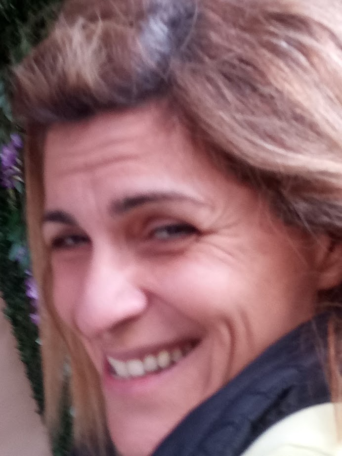

Title: Βιογραφικό 
Slug: CV
Author: username

| <h2 class="subtitle"> ΓΕΝΙΚΗ ΙΑΤΡΙΚΗ ( 22/03/2004 )</h2> |  |
|:------------------------------------------------------------------|:------------------------------------------------------------------:|

### ΕΚΠΑΙΔΕΥΣΗ
***ΜΕΤΑΠΤΥΧΙΑΚΕΣ ΣΠΟΥΔΕΣ*** 

2005-2007
> Μεταπτυχιακό πρόγραμμα **ΔΗΜΟΣΙΑΣ ΥΓΕΙΑΣ** (κατεύθυνση I Λειτουργοί Δημόσιας Υγείας) της Εθνικής Σχολής
> Δημόσιας Υγείας (Ε.Σ.Δ.Υ.) 2005-2007. Ολοκλήρωσα τον κύκλο σπουδών,
> κατέθεσα τη διπλωματική εργασία με θέμα «Τροφικές δηλητηριάσεις» η
> οποία εγκρίθηκε στις 23/02/2008 και απονεμήθηκε ο τίτλος του
> πτυχιούχου στις 7/04/2008.

***ΕΞΕΙΔΙΚΕΥΜΕΝΗ ΕΚΠΑΙΔΕΥΣΗ***

2004 - 2005 
> 10° ΜΕΤΕΚΠΑΙΔΕΥΤΙΚΟ ΠΡΟΓΡΑΜΜΑ ΣΤΗΝ **ΕΠΕΙΓΟΥΣΑ ΠΡΟΝΟΣΟΚΟΜΕΙΑΚΗ ΙΑΤΡΙΚΗ (Ε.Π.Ι.)** ΓΙΑ ΙΑΤΡΟΥΣ
> του Υπουργείου Υγείας & Κοινωνικής Αλληλεγγύης από Εθνικό Κέντρο
> Άμεσης Βοήθειας.

2004
> **Πρόγραμμα ΡΗ.Τ.Ι.δ.** (ΡτθίιοδρίίαΙ Τταυιπα ϋίθ δυρροά), το οποίο
> οργανώθηκε από το Ελληνικό Τμήμα του Αμερικάνικου Κολεγίου Χειρουργών
> και το Πανεπιστημιακό Νοσοκομείο Πατρών.

5/2005 - 10/2006 
> Εκπαιδευτικό πρόγραμμα **ΕΚΠΑΙΔΕΥΣΗ ΣΤΗΝ ΑΠΟΚΤΗΣΗ ΨΥΧΟΚΟΙΝΩΝΙΚΏΝ ΔΕΞΙΟΤΗΤΩΝ** 
> Ψυχιατρική Κλινική Παν/μίου Αθηνών,
> Εκπαιδευτικά Προγράμματα Προαγωγής Ψυχικής Υγείας - δθοίίοη οί Ρτίποτγ
> Οβτθ ΜθπΙαΙ ΗθαΙίΙτ,
> Ιηδΐίΐυΐθ οί Ρδγοίιίβίτγ, Κίη9’5 ΟοΙΙβρβ, ίοηάοη- ΕάυοαίίοηαΙ Ττυδί
> ίοτ ΗθαΙίίι ΐΓηρίΌνβΓηβηί ΐάτουςιά Οορηίίίνθ δίταίθργ (Ε.Τ.Η.Ι.Ο.δ),
> ιοηάοπ.

***ΕΚΠΑΙΔΕΥΣΗ ΕΚΠΑΙΔΕΥΤΩΝ*** 

 2/2003 - 10/2006
> **ΠΡΟΓΡΑΜΜΑ ΠΡΟΑΓΩΓΗΣ ΨΥΧΙΚΗΣ ΥΓΕΙΑΣ**. Ψυχιατρική Κλινική Παν/μίου Αθηνών,
> Εκπαιδευτικά Προγράμματα Προαγωγής Ψυχικής Υγείας - δοοίίοη οί  style="font-variant:small-caps;">Ρππίθγυ 03ΤΘ ΜβηίθΙ ΗθθΙίά,
> Ιηδίϊίυίθ οί ΡδγοίιίθίΓγ, Κίη9’3 ΟοΙΙθ9β, ίοηάοη- ΕάυοθίίοηθΙ Ττυδί
> ίοτ ΗθθΙίΙτ Ιτηρτονθτηθηί ίίιτου9ΐι Οθ9ηίίίνθ δίτ3ίβ9Υ (Ε.Τ.Η.Ι.Ο.δ),
> ίοηάοη

### ΣΥΜΜΕΤΟΧΗ ΣΕ ΕΡΕΥΝΗΤΙΚΟ ΕΠΙΣΤΗΜΟΝΙΚΟ ΕΡΓΟ

- **Αίτια συμπτωμάτων από τη σπονδυλική στήλη σε ηλικιωμένους**
\
Γεροντολογία και γηριατρική 2008, Σύνεδρον τόμος Β’ 95: 201-204 
\
_Ε. Μπρούσκος, Ε. Ζαχαράτου, Ι. Κουτσουμπός, Ζ. Καρατάσιου, Κ. Κωνσταντιίδου_

- **Κύριες αιτίες πτώσεων στους ηλικιωμένους**
\
Γεροντολογία και γηριατρική 2008, Σύνεδρον τόμος Β’ 5955: 201-204
\
_Ε. Μπρούσκος, Ε. Ζαχαράτου, Ι.Κουτσουμπός, Ζ. Καρατάσιου,Κ. Κωνσταντιδου_

### ΕΛΕΥΘΕΡΕΣ ΑΝΑΚΟΙΝΩΣΕΙΣ:
**19° Πανελλήνιο Συνέδριο Γενικής Ιατρικής- 2008**
- _Η θέση του Γ/Ο Ιατρού στην τροποποίηση της Θνητότητας των Καταγµάτων Ισχίων σε Ηλικιωμένους_

**16° Πανελλήνιο Συνέδριο Γενικής Ιατρικής - 2004**
- _Πρώιµο εμπύηµα Θώρακα,αντιμετώπιση µε στρεπτοκινάση. Η εμπειρία µας_
- _Η αντιμετώπιση του ασταθή θώρακα_

**15° Πανελλήνιο Συνέδριο Γενικής Ιατρικής - 2003**
- _Αντιμετώπιση της Κακοήθους Πλευρίτιδας. Η Εμπειρία µας_
- _Η θέση της Μεσοθωρακόσκοπησης στη Διάγνωση της Μεσοθωρακικής Λεμφαδενοπάθειας_
- _Αντιμετώπιση Πνευμοθώρακα. Εμπειρία 5 χρόνων_

**13° Πανελλήνιο Συνέδριο Γενικής Ιατρικής - 2001**
- _Η θέση του Γ/Ο Ιατρού στην τροποποίηση της Θνητότητας των Καταγµάτων Ισχίων σε Ηλικιωμένους_
- _Ένα Μοντέλο Ολιστικής Προσέγγισης του Γ/Ο Ιατρού στους Ασθενείς με Αγγειακό Εγκεφαλικό Επεισόδιο_

**12° Πανελλήνιο Συνέδριο Γενικής Ιατρικής - 2000**
- _Πρωτοπαθείς Κεφαλαλγίες και η Συνοσηρότητά τους. Η πρόκληση της διερεύνησης τους από το Ιατρό Γ/Ο Ιατρικής_

**11° Πανελλήνιο Συνέδριο Γενικής Ιατρικής - 1999**
- _Δύσπνοια: από το Σύμπτωμα στη Διάγνωση_

### ΕΚΠΑΙΔΕΥΤΙΚΟ ΕΡΓΟ

> Παρουσίαση Μαθήματος «Περιγραφικοί Επιδημιολογικοί Δείκτες και
> Ανάλυση Κατάστασης Υγείας ενός Πληθυσμού» στις 6/10/2003 στα
> πλαίσια των Μετεκπαιδευτικών Μαθημάτων των Ειδικευομένων Γενικής
> Ιατρικής.

> Παρακολούθηση εβδομαδιαίων Μαθημάτων του Κέντρου Υγείας Ψάχνων για
> την Εκπαίδευση του Ιατρικού Προσωπικού στα οποία συμμετείχα και ως
> Ομιλητής.

> Συμμετοχή στην Εκπαίδευση Ειδικευομένων Γενικής Ιατρικής του Κέντρου
> Υγείας Ψαχνών.

### ΣΕΜΙΝΑΡΙΑ 
**2002  -  Λ.Α.Ε.ΙΚ και ΟΑΕΔ** 

 - Αυτομµατισµός και Οργάνωση Ιατρικού Γραφείου µε τη Χρήση Η/Υ

 - Καταγραφή, Διαχείριση και Ανάλυση Επιστημονικών Δεδομένων µε ΑΟΟΕΟ5 καιΕΧΟΕΙ
 
 
**2001 - Επιτροπή Έρευνας της Ελληνικής Εταιρίας Γενικής Ιατρικής**

*"Από τη διατύπωση του ερευνητικού ερωτήματος στο σχεδίασμο"*
*_4° Σεμινάριο «Φιλίππειο Εργαστήριο της Έρευνας» 1^ος^ κύκλος_.*

**2005 - Καλαμπάκα**

"Συνήθη γαστρεντερολογικά προβλήματα στην Πρωτοβάθμια Φροντίδα Υγείας"

**2004 - Αθήνα**

"Ημέρες Παθολογίας"

_Διήμερο Σεμινάριο της Γ' Παθολογικής Κλινικής του Πανεπιστήμιου Αθηνών_

**2004 - Αθήνα**

"Νέες Ευρωπαϊκές και Αμερικάνικές κατευθυντήριες οδηγίες για την Υπέρταση και η Εφαρμογή τους στην καθημερινή κλινική πράξη"

_Ελληνικής Εταιρία Μελέτης Υπέρτασης_

sandy-5-ocr.docx

